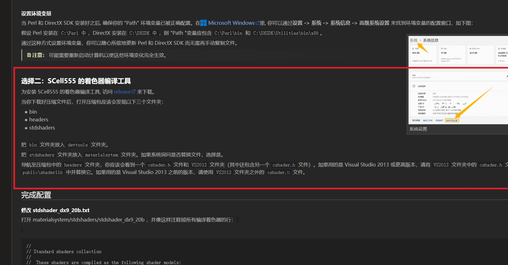

<p align="right">
  <a href="README.md">English</a> |
  <strong>简体中文</strong>
</p>

# 简单伤口 2

简单伤口 2 是一个 Garry's Mod 插件，可以在实体上创建最多三个基于骨骼、
带投影与顶点变形效果的伤口。

## 功能

- 每个实体最多三个独立伤口槽位。
- 支持顶点变形和椭球剔除两类伤口着色器。
- 同时提供无光照和 VertexLit 光照版本。
- 支持工具枪，可调整三轴缩放、血液范围、纹理以及 Lite Gore 兼容模式。
- 支持 NPC 伤害触发器，包括死亡时创建、布娃娃伤口和客户端尸体伤口。
- 内置英语、简体中文、繁体中文、日语、韩语、俄语、德语、法语、西班牙语、
  巴西葡萄牙语、波兰语、土耳其语、意大利语、荷兰语、瑞典语、捷克语和
  乌克兰语本地化。

## 目录结构

- `lua/`：插件逻辑、触发器、菜单和工具枪。
- `materials/`：随插件提供的伤口材质和纹理。
- `resource/localization/`：界面本地化文本。
- `binary/src/`：C++ 着色器桥接与着色器定义。
- `binary/src/shaders/hlsl/`：着色器源码。
- `binary/src/shaders/vcs/` 和 `binary/src/shaders/inc/`：二进制模块使用的
  已编译着色器数据。
- `TEMP/`：被忽略的旧版参考代码，不属于运行时插件内容。

## 着色器编译环境

参考文档：

https://developer.valvesoftware.com/wiki/Shader_Authoring

本项目使用 Source SDK 2013 的着色器编译流程，并依赖 SCell555 的
`ShaderCompile` 工具。仅安装一个独立的 HLSL 编译器不足以完成构建。

### 前置条件

1. Source SDK 2013 源码：
   https://github.com/ValveSoftware/source-sdk-2013
   使用提交 `b8cfb12c0e083a2ef5b2f9f9b50f3902fa034474`。
2. 从 Steam 安装 Source SDK Base 2013 运行版：
   `Source SDK Base 2013 Singleplayer`，如需兼容性测试则同时安装
   `Source SDK Base 2013 Multiplayer`。
3. SCell555 `ShaderCompile` 发布版：
   https://github.com/SCell555/ShaderCompile/releases/tag/build_235_20231013.2
4. `premake5`。
5. Visual Studio 2019 工具集。

完成 Valve 文档中圈出的环境准备步骤。项目中保留了对应截图：



### 配置着色器构建

1. 修改 `binary/buildshaders30.py` 中的默认 `--sdk-path`，或在运行时显式传入
   路径。该路径必须指向 SDK 源码中的 `materialsystem/stdshaders` 目录。
2. 如果你的 Garry's Mod 路径不是默认值，修改
   `binary/buildgmodshaders.bat` 中的 `GAME_DIR`。
3. 运行着色器构建：

```powershell
python binary/buildshaders30.py --sdk-path "C:\path\to\source-sdk-2013\src\materialsystem\stdshaders"
```

脚本会将项目 HLSL 复制到 SDK 目录，编译 DX9 着色器组合，并把生成的
`.vcs` 与 `.inc` 文件写回 `binary/src/shaders/vcs` 和
`binary/src/shaders/inc`。

## 编译二进制模块

先初始化子模块：

```bash
git submodule update --init --recursive
```

修改并运行 `binary/premakevs2019.bat` 或
`binary/premakevs2019_x86_x64.bat` 中对应路径。如果配置的输出路径不存在，
需要先手动创建，否则 Premake 或 Visual Studio 生成过程可能卡住。

脚本会生成以下兼容分支：

- `binary/premake5.lua`：主分支 32 位。
- `binary/premake5_x86_x64.lua`：x86_x64 分支 32 位和 64 位。

打开生成的解决方案并编译 Release 配置，需要生成：

- `gmcl_simple_wound_win32.dll`
- `gmcl_simple_wound_x86_x64_win32.dll`
- `gmcl_simple_wound_x86_x64_win64.dll`

将生成的 DLL 放入 `garrysmod/lua/bin`。着色器 `.vcs` 文件需要位于
`garrysmod/shaders/fxc`。

## 许可证

本项目包含来自多个来源的代码：

- GPLv3 部分：`LICENSE`
- `garrysmod_common`（MIT 风格许可证）：
  `binary/garrysmod_common/license.txt` 和
  `binary/garrysmod_common_x86_x64/license.txt`
- Source SDK 2013（SOURCE 1 SDK License）：
  `binary/garrysmod_common/sourcesdk-minimal/LICENSE` 和
  `binary/garrysmod_common_x86_x64/sourcesdk-minimal/LICENSE`
- 第三方声明：
  `binary/garrysmod_common/sourcesdk-minimal/thirdpartylegalnotices.txt` 和
  `binary/garrysmod_common_x86_x64/sourcesdk-minimal/thirdpartylegalnotices.txt`
